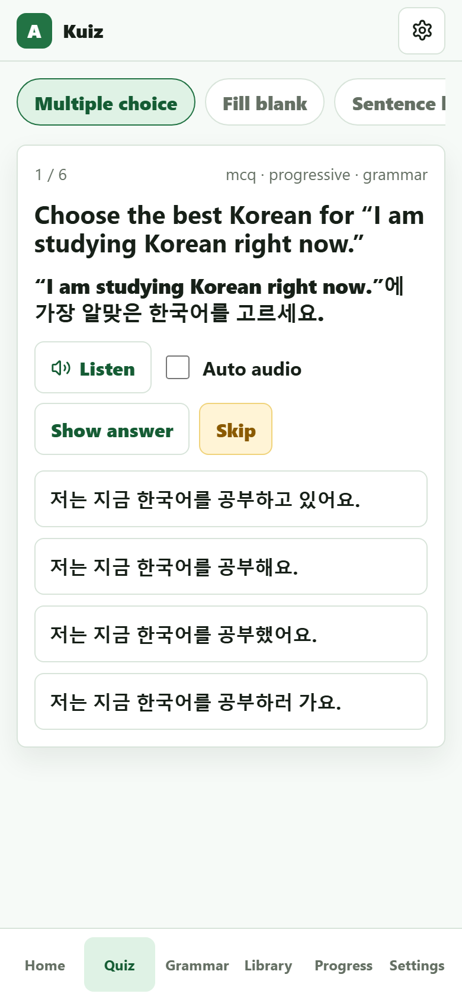
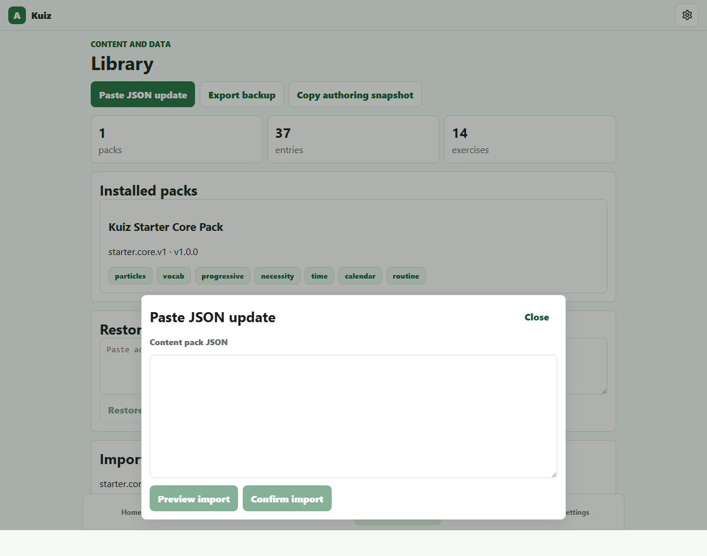

# Kuiz

[](https://github.com/abishek0504/kuiz/actions/workflows/ci.yml)
[](https://github.com/abishek0504/kuiz/actions/workflows/deploy-pages.yml)

Kuiz is a mobile-first Korean study app built as a static, local-first web application. It focuses on practical grammar, particles, sentence building, listening practice, and validated JSON content packs that can be extended without changing app code.

## Why It Stands Out

- Local-first storage with IndexedDB via Dexie, so study data stays on the device.
- Zod-validated content packs with import preview, dedupe checks, rollback snapshots, and transactional merge.
- Mobile-first quiz flow with sticky feedback, clear Skip vs Next behavior, and iPhone-safe layout.
- Korean-only speech synthesis with voice/rate settings and `ko-KR` defaults.
- Strict and relaxed particle checking for beginner-friendly practice without losing full-particle answers.
- Simplified FSRS-style scheduler using stability, difficulty, retrievability, lapses, and due dates.
- Automated quality gates with unit tests, pack validation, production build, Playwright E2E, and GitHub Actions.

## Screenshots

| Mobile Quiz | Library Import |
|---|---|
|  |  |

## Tech Stack

- React 18
- Vite
- TypeScript
- Dexie and IndexedDB
- Zod
- Vitest
- Playwright
- GitHub Actions

## Core Workflows

### Study

Quiz modes include multiple choice, fill-in-the-blank, sentence builder, and correction drills. Multiple-choice answers reveal immediate feedback, while free-answer modes respect the selected particle strictness.

### Import Content

Content packs live in `content-packs/` and must use schema `kuiz-pack@1`. The Library screen lets users paste JSON, validate it, preview create/update/skip/conflict counts, and merge transactionally into IndexedDB.

### Export Data

The Library screen supports full backup export and compact authoring snapshots. Snapshots include installed pack IDs, dedupe keys, tags, and settings so future content packs can avoid duplicates.

## Local Development

```bash
npm install
npm run dev
```

## Quality Checks

```bash
npm audit
npm run validate:pack
npm run test:run
npm run build
npm run e2e
```

## Deployment

Netlify:

```text
Build command: npm run build
Publish directory: dist
```

GitHub Pages is configured through `.github/workflows/deploy-pages.yml`. The workflow builds with `VITE_BASE=/kuiz/` so Vite assets resolve correctly from the project page URL.

## Project Structure

```text
content-packs/        Starter and future JSON content packs
src/db/               Dexie schema, settings, backup export
src/engine/           Scheduler, answer checking, normalization, distractors
src/features/         Main app screens
src/importExport/     Pack parsing, import preview, merge, backup, snapshot
src/schemas/          Zod schemas
e2e/                  Playwright browser tests
```

## License

MIT
