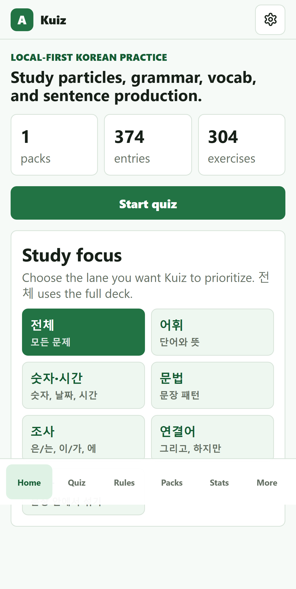
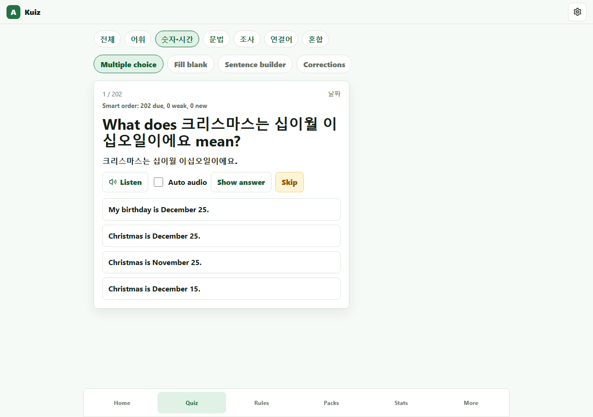
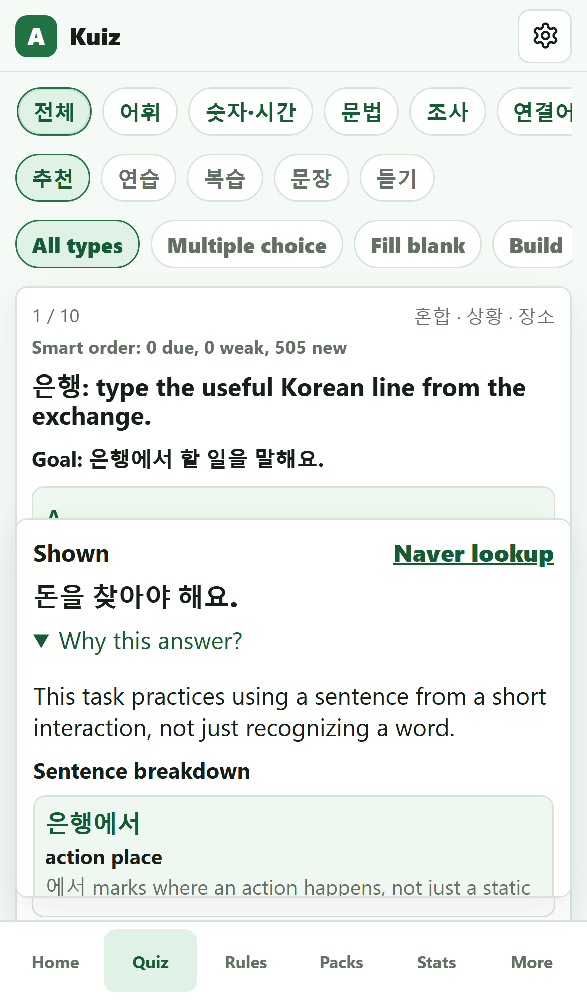

# Kuiz

[](https://github.com/abishek0504/kuiz/actions/workflows/ci.yml)
[](https://github.com/abishek0504/kuiz/actions/workflows/deploy-pages.yml)

Kuiz is a mobile-first Korean study app built from scratch with React, Vite, and TypeScript as a static, local-first web application. It focuses on practical grammar, particles, sentence building, listening practice, and validated JSON content packs that can be extended without changing app code.

## Why It Stands Out

- Local-first storage with IndexedDB via Dexie, so study progress, review state, mistakes, and settings stay on the device.
- Zod-validated content packs with import preview, dedupe checks, rollback snapshots, and transactional merge.
- Content quality gates reject weak imports with romanized audio, correct-first MCQs, bare numeric filler, missing distractor rationales, repeated generic choices, or grammar-only flashcard dumps.
- Recommended quiz sessions interleave scenario input, form noticing, production, repair, due review, and fluency work instead of starting learners in MCQ-only practice.
- Quiz has separate focus and question-type controls, so learners can study a category with only multiple choice, fill blanks, sentence building, corrections, dialogue, reading, or listening.
- Vocab practice has a dedicated Vocab Cards type and keeps the vocab focus on word/phrase meaning practice instead of broad grammar tasks that happen to contain vocabulary.
- Mini-sessions advance through unseen exercises; finishing a 10-question set shows a Session complete panel with answered/correct/review summary before continuing the next batch.
- `Try similar one` uses a slot-based variant engine with combinatorial banks for time ranges, place-time-object sentences, directions, and routine connectors while preserving particle roles and final predicates.
- Recommendation and progress diagnostics use due reviews, weak answers, logged mistake tags, and production/reception accuracy to decide whether to stay broad, repair weak lanes, or move into mixed production.
- Mobile-first quiz flow with sticky feedback, clear Skip vs Next behavior, and iPhone-safe layout.
- Feedback includes Korean sentence-role breakdowns for common particles, time/place markers, objects, connectors, and predicates, plus a collapsed translation reveal when English support is available.
- Korean-only speech synthesis with voice/rate settings and `ko-KR` defaults; pre-answer audio appears only for listening/dictation so it does not reveal ordinary quiz answers.
- Strict and relaxed particle checking for beginner-friendly practice without losing full-particle answers, plus tolerance for particle spacing and natural time/place word-order swaps before the final verb.
- Simplified FSRS-style scheduler using stability, difficulty, retrievability, lapses, and due dates.
- Production-only service worker and web manifest for offline use after first load.
- Expanded starter pack: 420 vocab entries, 51 particle entries, 51 grammar entries, and 505 exercises across MCQ, fill blank, sentence builder, correction, conjugation, dialogue, reading, listening, dictation, ordering, roleplay, and minimal-pair practice.
- Automated quality gates with unit tests, pack validation, production build, Playwright E2E, and GitHub Actions.

## Screenshots

| iPhone Recommendation | Desktop Quiz Focus | iPhone Feedback |
|---|---|---|
|  |  |  |

## Tech Stack

- React 18
- Vite
- TypeScript
- Dexie and IndexedDB
- Zod
- Vitest
- Playwright
- GitHub Actions

## Core Workflows

### Study

Quiz sessions use learner-facing intents: recommended, practice, review, sentence, and listening. The same focus rail appears on Home and Quiz: full deck, vocab, numbers/time, grammar, particles, connectors, and mixed sentence work. A second question-type rail lets learners choose all types or narrow to vocab cards, multiple choice, fill blanks, build, fix, dialogue, reading, or listening. Recommended sessions rotate through scenario input, form noticing, production, repair, due review, and fluency work. Completing a 10-question mini-session opens a Session complete panel with answered/correct/review stats and buttons to continue the next unseen batch, review missed items, or change focus/type. Multiple-choice answers reveal immediate feedback, while free-answer modes respect particle strictness, reject tense/negation mismatches and non-Hangul production answers, and accept natural particle-marked word-order variants when the sentence meaning is unchanged. Multi-blank particle items accept blank-only answers such as `부터 까지`, and similar practice can generate a fresh sentence variant without writing generated items into the content pack. Vocab focus and Vocab cards prioritize word/translation drills; runtime vocab cards can augment thin pools from pack vocabulary entries.

### Import Content

Content packs live in `content-packs/` and must use schema `kuiz-pack@1`. The starter pack contains lesson-PDF-derived particles, vocabulary, numbers, time/date expressions, routine practice, grammar patterns, corrections, sentence production, dialogues, readings, listening, dictation, ordering, roleplay, and minimal-pair exercises. The Library screen lets users paste JSON, validate schema and content quality, preview create/update/skip/conflict counts plus type/lane counts, and merge transactionally into IndexedDB.

The Library screen also includes a `Copy ChatGPT update prompt` workflow. Copy the prompt, paste it into chat with new lesson notes or PDF text, ask for JSON only, then paste the returned pack into `Paste JSON update`.

### Export Data

The Library screen supports full backup export and compact authoring snapshots. Snapshots include installed pack IDs, dedupe keys, tags, and settings so future content packs can avoid duplicates.

## Local Development

```bash
npm install
npm run dev
```

The dev server runs at `http://localhost:5173` by default.

## Quality Checks

```bash
npm audit
npm run validate:pack
npm run test:run
npm run build
npm run e2e
```

## Deployment

Netlify:

```text
Build command: npm run build
Publish directory: dist
```

The latest local production build is generated in `dist/`, which is the Netlify-ready static output folder. The folder is intentionally ignored by Git because Netlify and GitHub Pages should build it from source.

GitHub Pages is configured through `.github/workflows/deploy-pages.yml`. The workflow builds with `VITE_BASE=/kuiz/` so Vite assets resolve correctly from the project page URL.

Offline support is enabled in production builds through `public/sw.js`. It caches the app shell and same-origin assets after the first successful load, activates new service-worker versions without waiting on stale mobile tabs, and shows a compact offline indicator when the browser loses network access.

## Final Report

See [docs/FINAL_REPORT.md](docs/FINAL_REPORT.md) for the implemented scope, quality checks, screenshots, deployment notes, and known limitations.

## Project Structure

```text
content-packs/        Starter and future JSON content packs
src/db/               Dexie schema, settings, backup export
src/engine/           Scheduler, answer checking, normalization, distractors
src/features/         Main app screens
src/importExport/     Pack parsing, import preview, merge, backup, snapshot
src/schemas/          Zod schemas
e2e/                  Playwright browser tests
```

## License

MIT
